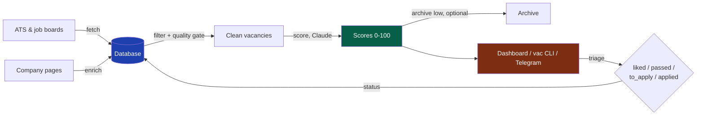

# llm-job-pipeline

Your own AI-powered job search: fetches vacancies from company career pages,
scores each one against *your* profile with Claude, and gives you a dashboard,
a terminal triage CLI and a daily Telegram digest. Self-hosted, MIT-licensed,
works for any field — engineering, design, ops, research, nonprofits.

**The core idea is company-first.** There are far fewer companies than
vacancies, and they are more stable: pick the organisations you actually want
to work for, monitor everything they post, and score every posting against
your profile — instead of doom-scrolling job boards. The pipeline automates
exactly that loop for 50+ companies without you reading a single irrelevant
posting.

## Two modes

1. **Simple mode — zero signups.** The database is a local SQLite file that
   creates itself; the dashboard runs on localhost; `/jobs-start` discovers your
   first companies from your profile and `/jobs` is your one daily command.
   No Supabase, no Vercel, ~5 minutes. Runbook: [INSTALL-EASY.md](INSTALL-EASY.md).
2. **Full mode — cloud setup.** Hosted Supabase database, password-protected
   Vercel dashboard you can open from your phone, daily Telegram digest with
   like/pass buttons. Two free accounts, ~15 minutes. Runbook: [INSTALL.md](INSTALL.md).

Fetching, filtering and scoring quality are identical in both. Simple mode
upgrades to full at any time: set `SUPABASE_DB_URL` and the same scripts
switch to Postgres, no code changes.

Easiest entry either way: fill in the
[onboarding questionnaire](https://ncalavera.github.io/llm-job-pipeline/)
(5 minutes, EN/RU) — it generates your candidate profile and one setup prompt
for your coding agent — Claude Code, Codex, or similar — which installs everything
and asks you only for the things it can't do itself.

## What's inside

- **Fetching:** native ATS integrations — Greenhouse, Lever, Ashby, Workable,
  Workday, Recruitee, Teamtailor, BambooHR, Personio, PageUp, Wagtail — plus a
  local scraper for everything else. Optional Firecrawl enrichment for JS-heavy
  career pages. Six opt-in job boards, all free APIs/feeds: 80,000 Hours
  (EA / AI safety), ReliefWeb (humanitarian), Arbeitnow (European tech with
  visa-sponsorship flags), Remotive and We Work Remotely (remote roles by
  category), and the monthly HN "Who is hiring?" thread (startups) — enable
  per run with e.g. `JOB_BOARDS=arbeitnow,remotive`.
- **Quality gate:** every job description passes a single validation layer
  (`scripts/quality.py`) that strips cookie banners, navigation junk and
  non-vacancy pages before they reach your database.
- **Filtering:** title blacklists, exact + fuzzy deduplication across boards,
  geography buckets (delete regions you'll never work in), auto-archive of
  vacancies that disappear from the source.
- **Scoring:** Claude scores every vacancy 0–100 against your profile —
  one vacancy per subagent for consistent judgement, with reasoning, tags,
  hard-requirements extraction and a summary. Same approach scores whole
  companies for mission/profile alignment.
- **Company-first review:** new companies arrive as candidates; strong
  vacancies at not-yet-reviewed companies get rescued and flagged hot, so you
  approve companies with evidence in front of you.
- **Triage:** dashboard (companies / catalog / pipeline / archive views),
  `/jobs-vac` terminal CLI, or a daily Telegram digest with 👍/👎 buttons that
  write statuses straight back to the database.

## Flow



Details: [docs/ARCHITECTURE.md](docs/ARCHITECTURE.md).

## What it costs (honestly)

- **Required: a coding-agent subscription you likely already have** —
  [Claude Code](https://claude.com/claude-code) (recommended; scoring
  benchmarked with Claude) or Codex and others, see [AGENTS.md](AGENTS.md).
  Scoring runs inside that subscription — no API keys, no per-token bills. Scoring ~50 vacancies is a normal daily session within plan limits.
- **Supabase** — only in full mode; free tier covers ~5,000 vacancies
  comfortably. Simple mode uses a local SQLite file: $0, no account.
- **Firecrawl** — optional and off by default. The local fetcher covers most
  ATS for free; Firecrawl ($20+/mo, free tier 500 scrapes) only adds
  enrichment for stubborn JS-heavy pages.
- **Vercel, GitHub** — free for a personal project.

Typical setup: **subscription you already have + $0/month.**

## What it does NOT do

- It won't find unpublished roles — a big share of good positions never get
  posted. Networking, referrals and communities stay on you.
- It's not a hosted service. You run it, you own the data, you babysit it
  (~10 minutes a day, one `/jobs-fetch → /jobs-filter → /jobs-score` cycle).
- It doesn't apply for you. It gets you a short, scored list worth your time.

## Quick start (full mode, manual)

Simple mode needs none of this — see [INSTALL-EASY.md](INSTALL-EASY.md).
Full mode requirements: Python 3.11+, Node.js 18+ (dashboard only), a
Supabase account, a coding-agent subscription (Claude Code recommended).

### 1. Clone and install

```bash
git clone https://github.com/ncalavera/llm-job-pipeline.git
cd llm-job-pipeline
pip install -r requirements.txt
cd api && npm install && cd ..
```

### 2. Create the database

1. Sign up at [supabase.com](https://supabase.com), create a project
   (free tier).
2. Open SQL Editor, paste `sql/schema.sql`, run.
3. Copy the URL and Service Role Key from Settings → API.

### 3. Fill in `.env`

```bash
cp .env.example .env
```

Set `SUPABASE_URL`, `SUPABASE_SERVICE_ROLE_KEY`, `SUPABASE_DB_URL`
(Settings → Database → Session Pooler — not the direct connection, which is
IPv6-only). No Anthropic API key needed.

### 4. Create your profile

```bash
cp config/user_profile.example.md config/user_profile.md
```

Fill in your experience, target roles, domains and exclusions — or generate
this file from the [onboarding questionnaire](https://ncalavera.github.io/llm-job-pipeline/).
The file feeds the scoring prompts via placeholders (`{{USER_PROFILE}}`,
`{{TARGET_ROLES}}`, `{{EXCLUDE_PATTERNS}}`). See [docs/PROMPTS.md](docs/PROMPTS.md).

### 5. Add companies to monitor

In your agent: `/jobs-add CompanyName` (non-Claude agents: follow `.claude/commands/jobs-add.md`) — auto-detects the ATS, adds the
company, runs a test fetch. Or bulk-import `examples/companies.example.csv`
via the Supabase SQL Editor.

### 6. Run the pipeline

```bash
python3 scripts/fetch_vacancies.py                  # fetch (TTL-aware)
python3 scripts/filter_vacancies.py                 # junk filter + dedup
python3 scripts/score_vacancies.py --local --limit 20   # score via your agent
python3 scripts/fetch_vacancies.py --report-only    # regenerate dashboard data
```

### 7. Deploy the dashboard (optional)

```bash
npm install -g vercel
vercel --prod
```

Set `SUPABASE_URL`, `SUPABASE_SERVICE_ROLE_KEY`, `AUTH_USER`, `AUTH_PASS` in
the Vercel project. Basic Auth protects the whole dashboard — it's your
private job search, keep a password on it.

### 8. Telegram digest (optional)

Daily top-5 unseen vacancies with 👍/👎 buttons. See
[INSTALL.md](INSTALL.md#9-telegram-digest-optional).

## Agent commands — three you actually use

You only need three:

| Command | When | What it does |
| --- | --- | --- |
| `/jobs-start` | once | Discovers starter companies from your profile, fetches, scores, opens the dashboard |
| `/jobs` | daily | Fetch → filter → score → top new matches in chat, like/pass verdicts saved |
| `/jobs-apply` | weekly | Deep review of liked vacancies — decide what to actually apply to |

`/jobs` runs the whole machinery (fetching, junk filtering, scoring,
archiving), so you never think about the stages. To add a company, just ask
the agent ("add Stripe") — it uses `/jobs-add` itself.

<details>
<summary><b>Advanced commands</b> — individual stages, for fine control</summary>

| Command | What it does |
| --- | --- |
| `/jobs-add` | Add a company: ATS auto-detection, test fetch |
| `/jobs-fetch` | Vacancy fetching alone, with source selection |
| `/jobs-filter` | Quality gate alone: junk removal, dedup, geography buckets |
| `/jobs-score` | LLM scoring alone (1 vacancy = 1 request) |
| `/jobs-archive` | Preview + confirm archiving of low scores |
| `/jobs-vac` | Terminal triage CLI, no dashboard needed |
| `/jobs-digest` | Send/poll the Telegram digest (full mode) |
| `/jobs-finish` | Regenerate dashboard, commit, push (full mode) |

</details>

Runbooks live in `.claude/commands/` — slash commands in Claude Code, plain
markdown runbooks for any other agent (see [AGENTS.md](AGENTS.md)). Full
reference: [docs/SKILLS.md](docs/SKILLS.md).

## Documentation

- [INSTALL.md](INSTALL.md) — agent-friendly install runbook
- [docs/ARCHITECTURE.md](docs/ARCHITECTURE.md) — data structures, modules, dataflow
- [docs/SKILLS.md](docs/SKILLS.md) — all slash commands
- [docs/PROMPTS.md](docs/PROMPTS.md) — scoring prompt templates and placeholders
- [docs/DATABASE.md](docs/DATABASE.md) — tables, indexes, access policies

## License

MIT — see [LICENSE](LICENSE).
