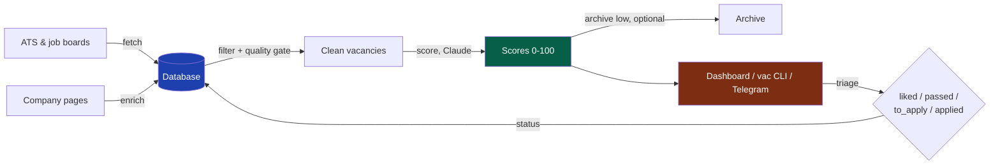

# llm-job-pipeline

[](https://github.com/ncalavera/llm-job-pipeline/actions/workflows/ci.yml)

Your own AI-powered job search: fetches vacancies from company career pages,
scores each one against *your* profile with Claude, and gives you a dashboard,
a terminal triage CLI and a daily Telegram digest. Self-hosted, MIT-licensed,
works for any field — engineering, design, ops, research, nonprofits.

**The core idea is company-first.** There are far fewer companies than
vacancies, and they are more stable: pick the organisations you actually want
to work for, monitor everything they post, and score every posting against
your profile — instead of doom-scrolling job boards. The pipeline automates
exactly that loop for 50+ companies without you reading a single irrelevant
posting.

## Two modes

1. **Simple mode — zero signups.** The database is a local SQLite file that
   creates itself; the dashboard runs on localhost; `/jobs-new` discovers your
   first companies from your profile and `/jobs-new` is your one daily command.
   No Supabase, no Vercel, ~5 minutes. Runbook: [INSTALL-EASY.md](INSTALL-EASY.md).
2. **Full mode — cloud setup.** Hosted Supabase database, password-protected
   Vercel dashboard you can open from your phone, daily Telegram digest with
   like/pass buttons. Two free accounts, ~15 minutes. Runbook: [INSTALL.md](INSTALL.md).

Fetching, filtering, company review and scoring quality are identical in
both — the same gates, the same auto-discovered-company rule, the same
scores. The only real differences: full mode adds a hosted dashboard you can
open from any device, a daily Telegram digest, and multi-device sync; simple
mode keeps everything on your machine. Simple mode upgrades to full at any
time: set `SUPABASE_DB_URL` and the same scripts switch to Postgres, no code
changes.

Easiest entry either way: fill in the
[onboarding questionnaire](https://ncalavera.github.io/llm-job-pipeline/)
(5 minutes, EN/RU) — it generates your candidate profile and one setup prompt
for your coding agent — Claude Code, Codex, or similar — which installs everything
and asks you only for the things it can't do itself.

## What's inside

- **Fetching:** native ATS integrations — Greenhouse, Lever, Ashby, Workable,
  Workday, Recruitee, Teamtailor, BambooHR, Personio, PageUp, Wagtail — plus a
  local scraper for everything else. Optional Firecrawl enrichment for JS-heavy
  career pages. A set of opt-in job boards, all free APIs/feeds — impact,
  remote-first, European-tech, startup and general boards, plus LinkedIn's guest
  API (queries derived from your profile). All off by default; enable the ones
  that fit you and they persist across runs. Full list, per-board audience and
  how to enable: [`docs/job-boards-catalogue.md`](docs/job-boards-catalogue.md).
- **Quality gate:** every job description passes a single validation layer
  (`scripts/quality.py`) that strips cookie banners, navigation junk and
  non-vacancy pages before they reach your database.
- **Filtering:** title blacklists, exact + fuzzy deduplication across boards,
  geography buckets (delete regions you'll never work in), auto-archive of
  vacancies that disappear from the source.
- **Scoring:** Claude scores every vacancy 0–100 against your profile —
  one vacancy per subagent for consistent judgement, with reasoning, tags,
  hard-requirements extraction and a summary. Same approach scores whole
  companies for mission/profile alignment.
- **Scoring-quality check:** `/jobs-eval` builds a *golden set* — a few dozen of
  your own vacancies labelled fits / doesn't-fit — and reports one number: how
  often the scorer agrees with you, plus the disagreements to fix. It seeds
  itself from your existing like/pass verdicts, so there's no upfront labelling
  wall. The set is personal and stays on your machine (gitignored `evals/`).
- **Company-first review:** new companies arrive as candidates; strong
  vacancies at not-yet-reviewed companies get rescued and flagged hot, so you
  approve companies with evidence in front of you.
- **Triage:** dashboard (Today, Vacancies, Companies, Applications, Boards,
  Settings sections), `/jobs-review` terminal CLI, or a daily Telegram digest
  with 👍/👎 buttons that write statuses straight back to the database.

## Flow



Details: [docs/ARCHITECTURE.md](docs/ARCHITECTURE.md).

## What it costs (honestly)

There is no per-token bill, but scoring is not free either — it draws on your
coding-agent plan. The real driver is one formula:
**plan tier × scoring model × number of vacancies scored.** The model tier is
the dial you set to match your plan.

- **Coding-agent subscription (required)** —
  [Claude Code](https://claude.com/claude-code) (recommended; scoring
  benchmarked with Claude) or Codex and others, see [AGENTS.md](AGENTS.md).
  Scoring runs inside that subscription — no API keys. To spend the strong model
  only where it matters, scoring is **two-pass**: a cheap model (`screen_model`,
  default Haiku) gives every new vacancy a fast first score, and the strong model
  (`scoring_model`) re-scores only the finalists that clear `escalate_threshold`.
  A budget plan (~$20) should score with **Sonnet**; a bigger plan (~$100-200)
  can afford **Opus**. You pick the models at onboarding and change them in one
  line — the `## VOLUME` section of your profile. A quiet day scores 20-30
  vacancies; a spike day is capped (`max_per_run`, default 150) so it can't
  silently drain your plan — the overflow is offered on the next run. Because the
  cheap screen escalates only the finalists, a typical Sonnet-tier day runs
  roughly a third cheaper than scoring everything with the strong model (more on
  an Opus tier) — the exact saving depends on how many roles clear the floor, and
  the strong-model tier stays the main cost dial.
- **Supabase** — only in full mode; free tier covers ~5,000 vacancies
  comfortably. Simple mode uses a local SQLite file: no account needed.
- **Firecrawl** — optional and off by default. The local fetcher covers most
  ATS for free; Firecrawl ($20+/mo, free tier 500 scrapes) only adds
  enrichment for stubborn JS-heavy pages.
- **Vercel, GitHub** — free for a personal project.

So the infrastructure is free; the variable cost is the plan usage your chosen
model spends on the vacancies you score each day.

## What it does NOT do

- It won't find unpublished roles — a big share of good positions never get
  posted. Networking, referrals and communities stay on you.
- It's not a hosted service. You run it, you own the data, you babysit it
  (~10 minutes a day, one `/jobs-new` cycle).
- It doesn't apply for you. It gets you a short, scored list worth your time.

## Quick start (full mode, manual)

Simple mode needs none of this — see [INSTALL-EASY.md](INSTALL-EASY.md).
Full mode requirements: Python 3.11+, Node.js 18+ (dashboard only), a
Supabase account, a coding-agent subscription (Claude Code recommended).

### 1. Clone and install

```bash
git clone https://github.com/ncalavera/llm-job-pipeline.git
cd llm-job-pipeline
pip install -r requirements.txt
cd api && npm install && cd ..
```

### 2. Create the database

1. Sign up at [supabase.com](https://supabase.com), create a project
   (free tier).
2. Open SQL Editor, paste `sql/schema.sql`, run.
3. Copy the URL and Service Role Key from Settings → API.

### 3. Fill in `.env`

```bash
cp .env.example .env
```

Set `SUPABASE_URL`, `SUPABASE_SERVICE_ROLE_KEY`, `SUPABASE_DB_URL`
(Settings → Database → Session Pooler — not the direct connection, which is
IPv6-only). No Anthropic API key needed.

### 4. Create your profile

```bash
cp config/user_profile.example.md config/user_profile.md
```

Fill in your experience, target roles, domains and exclusions — or generate
this file from the [onboarding questionnaire](https://ncalavera.github.io/llm-job-pipeline/).
The file feeds the scoring prompts via placeholders (`{{USER_PROFILE}}`,
`{{TARGET_ROLES}}`, `{{EXCLUDE_PATTERNS}}`) — the prompt templates live in
`scripts/prompts/` (see [docs/ARCHITECTURE.md](docs/ARCHITECTURE.md#prompts--neutrality)).

### 5. Add companies to monitor

In your agent: `/jobs-add CompanyName` (non-Claude agents: follow `.claude/commands/jobs-add.md`) — auto-detects the ATS, adds the
company, runs a test fetch. Or bulk-import `examples/companies.example.csv`
via the Supabase SQL Editor.

### 6. Run the pipeline

Make sure you have filled in `config/user_profile.md` (step 4) before scoring
— scoring against the example placeholder produces meaningless results.

```bash
python3 scripts/fetch_vacancies.py                  # fetch (TTL-aware)
python3 scripts/filter_vacancies.py                 # junk filter + dedup
python3 scripts/score_vacancies.py --local --limit 20   # score via your agent
python3 scripts/fetch_vacancies.py --report-only    # regenerate dashboard data
```

### 7. Deploy the dashboard (optional)

```bash
npm install -g vercel
vercel --prod
```

Set `SUPABASE_URL`, `SUPABASE_SERVICE_ROLE_KEY`, `AUTH_USER`, `AUTH_PASS` in
the Vercel project. Basic Auth protects the whole dashboard — it's your
private job search, keep a password on it.

### 8. Telegram digest (optional)

Daily top-5 unseen vacancies with 👍/👎 buttons. See
[INSTALL.md](INSTALL.md#9-telegram-digest-optional).

## Agent commands — three you actually use

You only need three:

| Command | When | What it does |
| --- | --- | --- |
| `/jobs-new` | once (first run) | Discovers starter companies from your profile, fetches, scores, opens the dashboard |
| `/jobs-new` | daily | Fetch → filter → score → top new matches in chat, like/pass verdicts saved |
| `/jobs-review` | weekly | Deep review of liked vacancies — decide what to actually apply to |

`/jobs-new` calls one Python driver (`scripts/run_daily.py`) that owns the whole
machinery — stage order, checkpoints, the live progress card, and the publish
gate. You never think about the stages, and the agent cannot run them out of
order: it only supplies judgment (scoring, verdicts) at the points the driver
pauses on, then resumes it. To add a company, just ask the agent ("add
Stripe") — it uses `/jobs-add` itself.

<details>
<summary><b>Advanced commands</b> — individual stages, for fine control</summary>

| Command | What it does |
| --- | --- |
| `/jobs-add` | Add a company: ATS auto-detection, test fetch |
| `/jobs-review` | Deep review of liked vacancies, archive low scores, terminal triage |
| `/jobs-eval` | Scoring-quality check: label a golden set of your own vacancies, measure how well the scorer agrees with you |
| `/jobs-profile` | Update scoring rules and candidate profile |
| `/jobs-digest` | Send/poll the Telegram digest (full mode) |
| `/jobs-update` | Pull latest code, refresh deps, apply DB migrations |

</details>

Runbooks live in `.claude/commands/` — slash commands in Claude Code, plain
markdown runbooks for any other agent (see [AGENTS.md](AGENTS.md)). "Works with
any agent" is real because the deterministic core is Python: any agent that can
run shell drives the daily loop with `python3 scripts/run_daily.py` and only
does the LLM scoring + user verdicts at the gates it prints. Full command
reference: [AGENTS.md](AGENTS.md).

<details>
<summary><b>Upgrading from before the command restructure?</b> — old → new mapping</summary>

The many single-stage commands collapsed into the six above:

| Old command(s) | Now |
| --- | --- |
| `jobs`, `jobs-fetch`, `jobs-filter`, `jobs-score`, `jobs-start`, `jobs-finish` | `/jobs-new` |
| `jobs-apply`, `jobs-archive`, `jobs-vac` | `/jobs-review` |
| `jobs-rules` | `/jobs-profile` |
| `jobs-add`, `jobs-digest`, `jobs-update` | unchanged |

</details>

## Updating

To update an existing install, run `/jobs-update` in your agent. It pulls the
latest code, refreshes Python dependencies if needed, and applies pending DB
migrations with an automatic backup.

Manually:

```bash
git pull --ff-only
pip install -r requirements.txt
python3 scripts/migrate.py
```

`migrate.py` backs up before touching anything (SQLite file copy, Postgres
`pg_dump`) and is safe to re-run — already-applied migrations are skipped. If
there is nothing pending, it prints "Up to date" and exits.

## Documentation

- [INSTALL-EASY.md](INSTALL-EASY.md) — simple-mode install (zero signups)
- [INSTALL.md](INSTALL.md) — full-mode install runbook (Supabase + Vercel)
- [docs/ARCHITECTURE.md](docs/ARCHITECTURE.md) — module map, pipeline stages, the two backends
- [docs/job-boards-catalogue.md](docs/job-boards-catalogue.md) — the built-in boards, generated from config
- [docs/fetch-engines.md](docs/fetch-engines.md) — every fetch engine: what it hits, config keys, failure modes, debug recipes
- [AGENTS.md](AGENTS.md) — the runbooks / slash commands, for any coding agent
- [CONCEPTS.md](CONCEPTS.md) — domain vocabulary (entities, statuses, processes)
- [sql/schema.sql](sql/schema.sql) — the database schema (Postgres; SQLite variant alongside)
- [docs/manual-trial-protocol.md](docs/manual-trial-protocol.md) — pre-release manual QA checklist (~30 min) + live user retest guide

## License

MIT — see [LICENSE](LICENSE).
