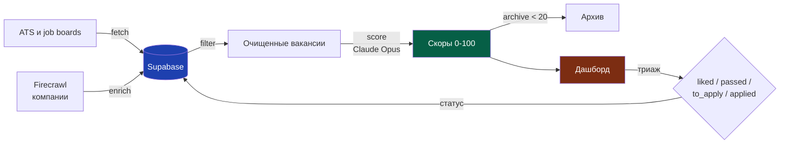

# llm-job-pipeline

Собирает вакансии из ATS и job-боардов, фильтрует мусор, оценивает
каждую через Claude по профилю пользователя, показывает в дашборде с
триажем (нравится / отложить / откинуть).

Покрывает 50+ компаний без ручного просмотра. Настройка профиля и
SQL-схемы — 30 минут.

Английский в коде нужен только для базы Supabase. Дашборд и профиль —
на любом языке.

## Что внутри

- **Сбор:** ATS Greenhouse, Lever, Ashby, Workable, Workday, Recruitee,
  Teamtailor, BambooHR, Personio плюс job boards 80,000 Hours и
  ReliefWeb. Дополнительно — Firecrawl для парсинга компаний без API.
- **Фильтр:** чёрный список по заголовкам, удаление дубликатов (точное и
  fuzzy сравнение), фильтр по локациям.
- **Скоринг:** Claude Opus параллельно скорит вакансии по вашему профилю
  (1 вакансия = 1 subagent). Те же критерии применяются к компаниям.
- **Дашборд:** Vercel + Supabase, четыре режима (компании / вакансии /
  триаж / гео). Статусы вакансий синхронизируются в реальном времени.
- **Скиллы:** набор слэш-команд для Claude Code (`/fetch`, `/score`,
  `/filter`, `/triage`, `/archive`, `/vac`) — пошаговый интерактив для
  каждой стадии.

## Схема потока



Подробнее — в [docs/ARCHITECTURE.md](docs/ARCHITECTURE.md).

## Быстрый старт

Нужны: Python 3.11+, Node.js 18+, аккаунт Supabase, подписка Claude Code
(Max / Team / Enterprise — для скоринга через subagent'ов). Firecrawl
платный, но необязательный — без него работает без обогащения.

### 1. Клонировать репозиторий и поставить зависимости

```bash
git clone https://github.com/your-username/llm-job-pipeline.git
cd llm-job-pipeline
pip install -r requirements.txt
cd api && npm install && cd ..
```

### 2. Создать проект в Supabase и применить схему

1. Зарегистрироваться на [supabase.com](https://supabase.com), создать
   проект (бесплатный тариф достаточно на старте).
2. Открыть SQL Editor, вставить содержимое `sql/schema.sql`, нажать Run.
3. Скопировать URL и Service Role Key из Settings → API.

### 3. Заполнить `.env`

```bash
cp .env.example .env
```

Прописать `SUPABASE_URL`, `SUPABASE_SERVICE_ROLE_KEY`, `SUPABASE_DB_URL`.
Источник URL подключения к Postgres — Settings → Database → Session
Pooler. Ключ Anthropic API НЕ нужен — скоринг работает через
subagent'ов в Claude Code (по подписке).

### 4. Создать профиль пользователя

```bash
cp config/user_profile.example.md config/user_profile.md
```

Открыть `config/user_profile.md` и расписать секции под себя: опыт,
целевые роли, домены, исключения. Файл попадает в шаблоны промптов через
плейсхолдеры (`{{USER_PROFILE}}`, `{{TARGET_ROLES}}`,
`{{EXCLUDE_PATTERNS}}`). Подробнее — в [docs/PROMPTS.md](docs/PROMPTS.md).

### 5. Добавить компании для мониторинга

Минимум — импортировать пример из `examples/companies.example.csv`. В
Supabase SQL Editor:

```sql
COPY company (canonical_name, fetch_strategy, ats_slug, careers_url, tier, category, status, aliases)
FROM '/path/to/llm-job-pipeline/examples/companies.example.csv'
DELIMITER ',' CSV HEADER;
```

Или через `/add-source` в Claude Code (см. [docs/SKILLS.md](docs/SKILLS.md)).

### 6. Запустить конвейер

```bash
# Собрать вакансии (TTL 3-7 дней — повторный запуск пропускает свежие)
python3 scripts/fetch_vacancies.py

# Отфильтровать мусор (blacklist по заголовкам, дубликаты)
python3 scripts/filter_vacancies.py

# Скорить через Claude (Opus subagent на каждую вакансию)
python3 scripts/score_vacancies.py --local --limit 20

# Сгенерировать дашборд (выгружает все статусы в public/data.js)
python3 scripts/fetch_vacancies.py --report-only
```

### 7. Развернуть дашборд

```bash
# Установить Vercel CLI один раз
npm install -g vercel

# Деплой
vercel --prod
```

В настройках проекта Vercel прописать переменные `SUPABASE_URL`,
`SUPABASE_SERVICE_ROLE_KEY`, `AUTH_USER`, `AUTH_PASS`.

## Использование в Claude Code

В репозитории есть набор слэш-команд (папка `.claude/commands/`). Если
запустить Claude Code из корня репозитория, эти команды появятся
автоматически:

| Команда | Что делает |
| --- | --- |
| `/fetch` | Интерактивный сбор вакансий с выбором источников и кэша |
| `/filter` | Прогон фильтра, очистка мусора |
| `/score` | Скоринг через subagent (1 вакансия = 1 параллельный запрос) |
| `/archive` | Превью + подтверждение архивирования низких скоров |
| `/triage` | Глубокий разбор «лайкнутых» вакансий, решение apply/skip/research |
| `/vac` | CLI-триаж из терминала без открытия дашборда |
| `/add-source` | Добавить новую компанию: автодетект ATS, тестовый сбор |
| `/finish-session` | Перегенерация дашборда, коммит, push в Vercel |

Полное описание — в [docs/SKILLS.md](docs/SKILLS.md).

## Документация

- [docs/ARCHITECTURE.md](docs/ARCHITECTURE.md) — структура данных,
  модули, dataflow.
- [docs/SKILLS.md](docs/SKILLS.md) — описание всех слэш-команд.
- [docs/PROMPTS.md](docs/PROMPTS.md) — как устроены шаблоны
  scoring-промптов, какие плейсхолдеры доступны.
- [docs/DATABASE.md](docs/DATABASE.md) — таблицы, индексы, политики
  доступа.

## Стек и оплата внешних сервисов

Скоринг работает через subagent'ов в Claude Code (подписка Max / Team /
Enterprise), не через Anthropic API. Оплата — фиксированная подписка,
расход внутри токен-лимита. `score_vacancies.py --local` выгружает
вакансии в stdout, orchestrator в Claude Code запускает subagent на
каждую и пишет результат обратно. Режима с прямыми вызовами API в
текущей версии нет.

Firecrawl — платный, $20–80/месяц. Используется для обогащения описаний
вакансий и страниц компаний. Free tier — 500 скрэйпов в месяц, на
серьёзном поиске кончается за неделю. Без `FIRECRAWL_API_KEY` конвейер
работает, но без обогащения.

Supabase free tier — 500 МБ БД и 2 ГБ трафика, хватает на ~5000
вакансий. Pro $25/месяц на больших объёмах.

Vercel и GitHub — бесплатно для одного личного проекта.

Суммарно: $25–100/месяц в зависимости от объёма поиска.

## Лицензия

MIT — см. [LICENSE](LICENSE).
