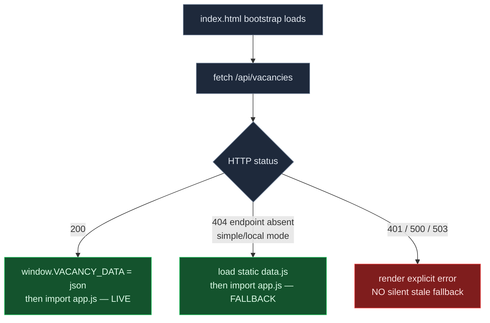

# feat: Dashboard reads live from Supabase — no redeploy per data change

## Summary

In **full mode**, the pipeline writes the assembled dashboard payload to a one-row
Supabase snapshot table instead of (only) baking `public/data.js` and redeploying. A new
auth-protected `GET /api/vacancies` returns that row; the front-end fetches it on load and
keeps doing all filtering/sorting in the browser unchanged. A browser refresh then shows
current data with **no `vercel --prod`**. **Simple mode** (local SQLite) is untouched —
`generate_dashboard` still writes `public/data.js` and the front-end falls back to it.

This is the **snapshot** architecture chosen in eng review: reuse the one heavy Python
transform (`generate_dashboard`) as the single source of payload shape; the endpoint stays
a thin SELECT. No reimplementation of the transform in JS, so no two-language drift.

---

## Problem Frame

Today every data change (fetch, score, verdict, archive) runs `--report-only` to
regenerate `public/data.js` (~8.7 MB) and then `vercel --prod` to publish it. The deploy
is slow and fragile — a regen from the wrong working dir wiped the snapshot once (the
worktree-clobber incident). Goal: kill the per-data-change **deploy**, not the regen.
Deploy only when dashboard **code** changes.

---

## Key Technical Decisions

- **KTD1 — Snapshot row, not live transform.** `generate_dashboard`
  (`scripts/report/__init__.py:76-185`) does heavy assembly (grouping, company tiers,
  enrichment stats, i18n, packs). Reimplementing that in the JS endpoint would duplicate
  complex logic across two languages and drift. Instead, persist its output to Supabase
  and SELECT it. A raw DB edit isn't reflected until the next regen — already true today
  (baked structural data + live status overlay via `/api/statuses`). No new staleness.
  (see origin: docs/brainstorms/2026-06-24-live-supabase-dashboard-requirements.md)
- **KTD2 — Front-end bootstrap + dynamic import, not an async state.js rewrite.**
  `public/modules/state.js:5-21` destructures `window.VACANCY_DATA` **synchronously at
  module-eval**, and every module reads those bindings. A bootstrap loader populates
  `window.VACANCY_DATA` *before* the module graph loads, so `state.js`, `catalog.js`, and
  all consumers stay unchanged.
- **KTD3 — Endpoint fails closed + same-origin.** `api/statuses.js` does no auth of its
  own and sets `Access-Control-Allow-Origin: *` (`api/statuses.js:4`); the only gate is
  `middleware.js`, which is opt-in (`middleware.js:88-94`: no `AUTH_USER`/`AUTH_PASS` →
  open). For a PII payload that's too weak: `/api/vacancies` self-guards (refuse to serve
  when auth env is absent) and drops the wildcard CORS.
- **KTD4 — `no-store` on the endpoint** so a refresh never serves a stale cached payload.

---

## High-Level Technical Design

Front-end source selection on page load:

Data write path (full mode): `--report-only` → `generate_dashboard` builds `vacancy_data`
→ **upsert** into `dashboard_snapshot` (no file, no deploy). Simple mode: same build →
write `public/data.js` (no DB, no deploy).

---

## Requirements

- **R1** Full mode: a data change is visible on browser refresh with no deploy.
- **R2** Live endpoint is auth-protected; no PII reachable unauthenticated (incl. the
  opt-in-auth gap — fail closed).
- **R3** Simple mode still renders from the static `data.js` snapshot.
- **R4** `/jobs-new` and `/jobs-review` publish step updated for full mode (regen upserts
  snapshot, no per-run deploy).

---

## Implementation Units

### U1. `dashboard_snapshot` table

- **Goal:** A one-row Supabase table to hold the latest assembled payload.
- **Requirements:** R1
- **Dependencies:** none
- **Files:** `sql/migrations/<next>__dashboard_snapshot.sql` (new), `sql/schema.sql`
  (mirror the table for fresh installs), `tests/test_migrate.py`,
  `tests/test_schema_integrity.py`
- **Approach:** `dashboard_snapshot(id TEXT PRIMARY KEY DEFAULT 'current', payload JSONB
  NOT NULL, updated_at TIMESTAMPTZ NOT NULL DEFAULT now())`. Single fixed-id row, upserted.
  Follow the forward-only delta convention in `sql/migrations/` (managed by
  `scripts/migrate.py`). RLS stays disabled (consistent with `sql/schema.sql:148-159`) —
  access is via the service-role endpoint only. Postgres-only; the SQLite schema does not
  get this table (simple mode never reads it).
- **Patterns to follow:** existing migration files in `sql/migrations/`, the table block
  style in `sql/schema.sql`.
- **Test scenarios:**
  - `test_migrate`: applying migrations from empty creates `dashboard_snapshot` with the
    expected columns; migration is idempotent / forward-only per existing harness.
  - `test_schema_integrity`: `schema.sql` and the migration agree on the table shape (no
    drift) — mirror whatever invariant the existing test enforces for other tables.

### U2. `generate_dashboard` upserts the snapshot in full mode

- **Goal:** Persist the assembled payload to the snapshot row in full mode; keep writing
  `data.js` in simple mode. Reuse the existing transform — build the payload once.
- **Requirements:** R1, R3
- **Dependencies:** U1
- **Files:** `scripts/report/__init__.py`, `tests/test_dashboard_generation.py`
- **Approach:** After `vacancy_data` is assembled (`__init__.py:159-176`), branch on mode
  (`IS_SQLITE` from `scripts/db_backend.py:33-38`, or the report module's existing backend
  signal — confirm which is in scope here). Full mode: upsert `{id:'current', payload:
  vacancy_data}` into `dashboard_snapshot` via the same Supabase client the pipeline
  already uses; do **not** write `data.js`. Simple mode: unchanged — write `data.js` as
  today (`__init__.py:178-184`). Keep the payload byte/shape identical regardless of sink
  so client filtering can't regress. **Decided:** full mode stops writing `data.js`
  entirely (kills the clobber + stale-copy risk; if Supabase is down the dashboard just
  won't load — acceptable for a single user). The bootstrap 404 path covers simple mode.
- **Patterns to follow:** the Supabase write path the pipeline already uses for vacancy
  rows; `api/_supabase.js` is the JS analog but this is Python — use the Python DB backend.
- **Test scenarios:**
  - Full mode (mocked Supabase): `generate_dashboard` upserts one row whose `payload`
    deep-equals the `vacancy_data` dict it builds. Asserts shape compatibility with the
    legacy `data.js` payload (same top-level keys: `config`, `stats`, `enrichment_stats`,
    `vacancy_ids`, `groups`, `companies`, `triage_reviews`, `archived_groups`).
    `Covers R1.`
  - Full mode does **not** write `public/data.js` (the snapshot row is the only sink).
  - Simple mode (`IS_SQLITE`): still writes `public/data.js`, does **not** touch the
    snapshot table. `Covers R3.`

### U3. `GET /api/vacancies` endpoint

- **Goal:** A thin, auth-safe endpoint returning the snapshot payload.
- **Requirements:** R1, R2
- **Dependencies:** U1
- **Files:** `api/vacancies.js` (new), `api/vacancies.test.js` (new),
  `api/middleware.test.js` (new — for the 401 path), `package.json` (add
  `"scripts": { "test:js": "node --test" }`)
- **Test harness (decided):** the repo has **no** JS test runner today (pytest only tests
  the Python local server, not the Vercel `api/*.js` functions). Use Node's **built-in**
  test runner (`node --test`, `node:test` + `node:assert`) — zero new dependencies, node
  ≥18 is already required. Import each handler, call it with stub `req`/`res` objects and a
  controlled `process.env`. The fail-closed `503` is asserted on the `api/vacancies.js`
  handler; the `401` unauthenticated path is asserted on the `middleware.js` default export.
  Run `node --test` in addition to pytest (note for `/finish`/CI).
- **Approach:** Model on `api/statuses.js`: import `getSupabase`/`validateConfig` from
  `api/_supabase.js`, `GET`-only, `SELECT payload FROM dashboard_snapshot WHERE id =
  'current'`, return `payload` as JSON. Differences from the template: (a) **no**
  `Access-Control-Allow-Origin: *` — same-origin; (b) **fail closed** — if `!AUTH_USER ||
  !AUTH_PASS`, return `503 {error:"auth not configured"}` and serve nothing (covers the
  `middleware.js:88-94` opt-in gap for this PII surface); (c) `Cache-Control: no-store`;
  (d) `500` on missing Supabase config or DB error, like `statuses.js:12-17,41-44`.
- **Patterns to follow:** `api/statuses.js` (structure, method guard, error shape),
  `api/_supabase.js` (`getSupabase`).
- **Test scenarios:**
  - Returns `200` with the snapshot payload when auth + Supabase env are set.
  - **Fail closed:** `AUTH_USER`/`AUTH_PASS` absent → `503`, body contains no vacancy
    data. `Covers R2.`
  - With auth enabled (`middleware.js`), a request with no/invalid Basic creds is
    challenged with `401` and no payload. `Covers R2.`
  - Response carries `Cache-Control: no-store` and no `Access-Control-Allow-Origin: *`.
  - `POST` → `405`; missing Supabase config → `500`.

### U4. Front-end bootstrap loader

- **Goal:** Source `window.VACANCY_DATA` from the API with a clean fallback, without
  touching the rest of the front-end.
- **Requirements:** R1, R3
- **Dependencies:** U3
- **Files:** `public/index.html` (replace the `` with a small loader
  that, before importing `app.js`: `fetch(location.origin + "/api/vacancies")`. On `200`
  → `window.VACANCY_DATA = await res.json()` then `import("./app.js")`. On `404` → inject
  `<script src="data.js">` (await load) then `import("./app.js")` — the simple/local path.
  On `401/500/503` → render an explicit in-page error and do **not** import a possibly
  stale/absent `data.js`. Keep `<script type="module" src="app.js">` out of static HTML;
  the loader triggers the import. `state.js:5-8` guard stays (genuine error if neither
  path populated the global). `state.js`, `catalog.js`, all consumers unchanged.
- **Patterns to follow:** the existing `API_BASE`/origin logic in `state.js:26-33`; the
  existing live-fetch pattern in `app.js:283-308`.
- **Test scenarios:**
  - `404` from `/api/vacancies` → loader loads `data.js` and the dashboard renders from
    the static global (simple/local mode). `Covers R3.`
  - `200` → dashboard renders from the fetched payload, no `data.js` request made.
  - `503`/`500` → explicit error state shown; no silent fallback render.
  - `Execution note: start with the 404-fallback test — it pins the simple-mode contract
    that must not regress.`

### U5. Runbook edits (`/jobs-new`, `/jobs-review`)

- **Goal:** Stop the per-data-change deploy in full mode; keep the regen step.
- **Requirements:** R4
- **Dependencies:** U2, U3, U4
- **Files:** `.claude/commands/jobs-new.md` (Step 9 Publish, ~436-479),
  `.claude/commands/jobs-review.md` (~390-416)
- **Approach:** Full mode: `--report-only` now upserts the snapshot (fast, no deploy);
  remove the `vercel --prod` data-publish step and state that deploy is **code-only** now.
  Keep the worktree warning: never run `--report-only` from a worktree. Simple mode text
  unchanged (local regen → `data.js`, never deploy). Update `tests/test_no_stale_*` /
  command-lint tests if they assert on the publish wording.
- **Test scenarios:** `Test expectation: docs/runbook edits — covered by existing command
  consistency tests (e.g. tests/test_no_stale_jobs_command.py) if they assert publish
  wording; otherwise none.`

---

## Scope Boundaries

**In scope:** snapshot table + migration; `generate_dashboard` dual-sink; `/api/vacancies`
with fail-closed + no-store + same-origin; front-end bootstrap with honest error states;
runbook edits; the test coverage above.

**Out of scope (not now):** server-side pagination/filtering; trimming heavy fields /
lazy-load; enabling RLS or anon-key client access; any simple-mode behavior change.

### Deferred to Follow-Up Work

- Confirm `AUTH_USER`/`AUTH_PASS` are set in the Vercel project — a **ship step**, not
  code. Without them the endpoint fails closed (503), so PII is never exposed; the dashboard
  just won't load until they're set. Verify at deploy time.

---

## Risks & Dependencies

- **PII exposure** is the headline risk; mitigated by KTD3 fail-closed + the U3 tests. The
  residual is purely operational: env vars not set → dashboard down (safe), not leaking.
- **Payload shape drift** between the snapshot row and what the front-end expects →
  client filter regression. Mitigated by the U2 deep-equal round-trip test.
- **Worktree clobber (iron):** work happens in a worktree. Do **NOT** run `--report-only`
  from the worktree — it wipes main's `public/data.js`. Generate/verify data only from a
  full-mode checkout against Supabase, never the worktree.
- **Deploy is `vercel --prod` only**; this change is code, so it ships via one normal
  deploy. After it ships, data changes no longer deploy.

---

## Verification

- Full-mode regen upserts the snapshot; a browser refresh shows the change with no deploy
  (R1). Endpoint returns `503` with auth env unset and `401` unauthenticated (R2). Simple
  mode still renders from `data.js` (R3). Runbooks no longer instruct a data-change deploy
  in full mode (R4). Whole pytest suite stays green (currently 614 passed).

---

## Sources & Research

- Origin requirements: `docs/brainstorms/2026-06-24-live-supabase-dashboard-requirements.md`
- Grounding (verified file:line): `api/statuses.js`, `api/_supabase.js`, `middleware.js`,
  `public/modules/state.js`, `public/index.html:355`, `public/app.js:283-308`,
  `scripts/report/__init__.py:76-185`, `sql/schema.sql:75-159`, `scripts/db_backend.py:33-38`.
- No external research: strong local pattern (6 existing `api/*.js` endpoints; `statuses.js`
  is the direct template).
